<h1 align = "center">CAC Movies</h1>

  

## Description 📝
This is the final exercise of the course Fullstack PHP supported by Codo a Codo.

## Deploy ✈️
This project was deployed using two hosts. 

000webhost: https://dried-lake.000webhostapp.com

InfinityFree: https://cac-movies-24144.lovestoblog.com

### Admin account:
> Email: admin@admin.com
> Password: admin

## Tools used

  
  
  
  ᲼
  
  ᲼
  

## Photos of the page
#### Index.php
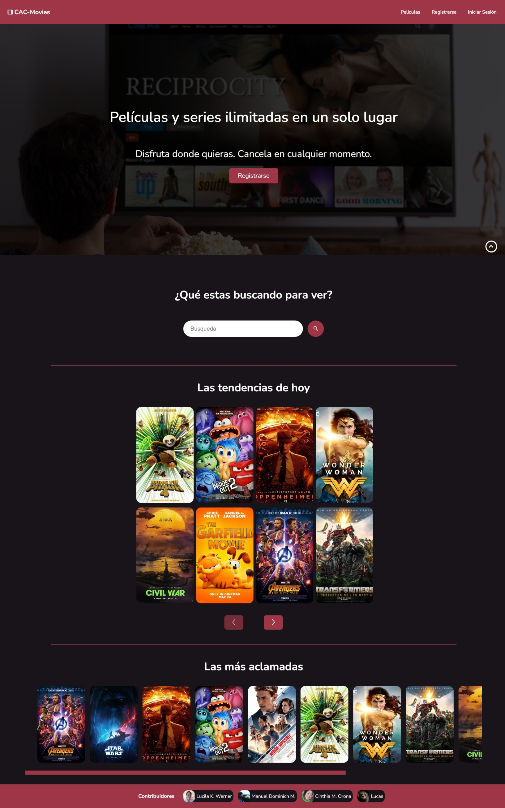

#### Movies.php
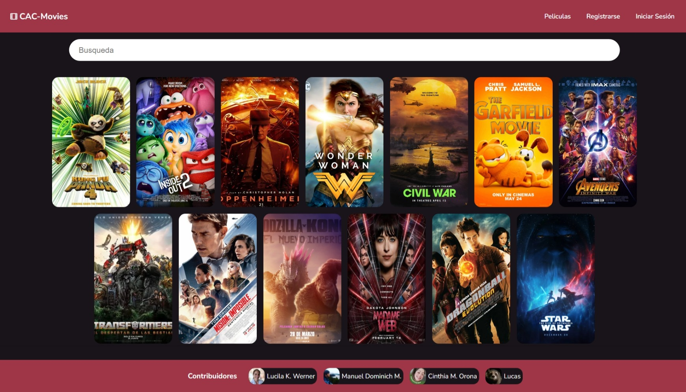

#### Movie.php
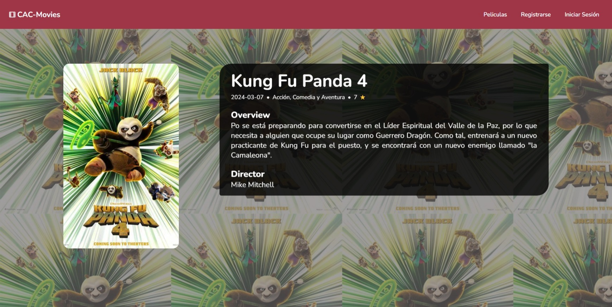

#### Register.php
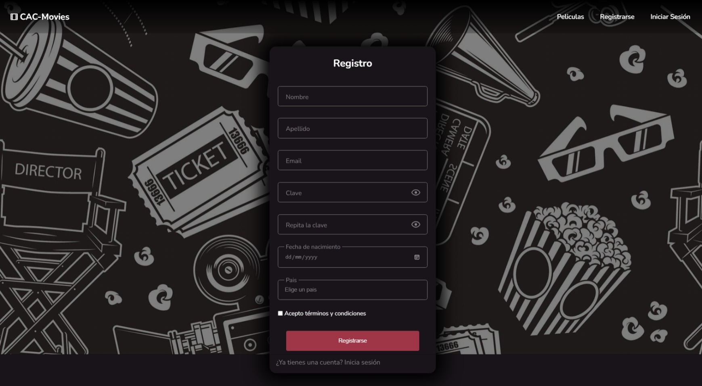

#### Login.php
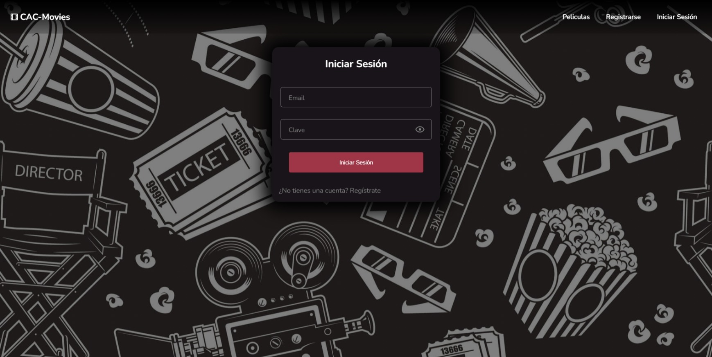

#### Dashboard.php
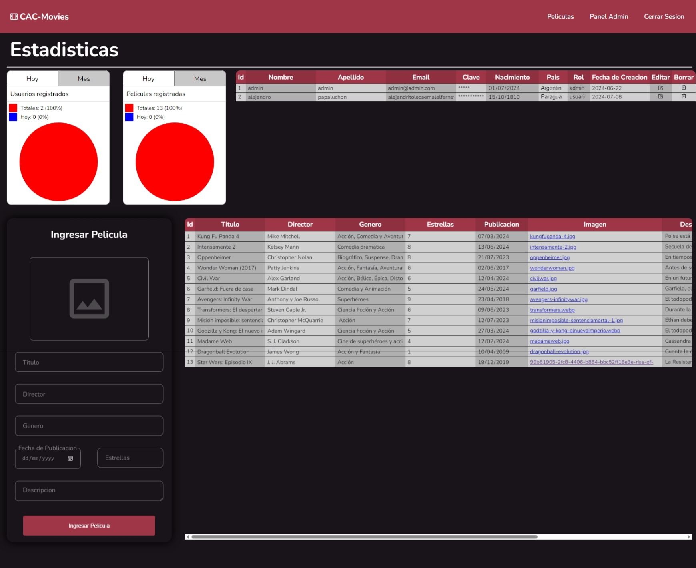

### Mobile version
#### Index.php
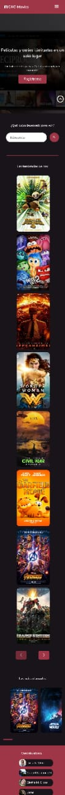

#### Movies.php
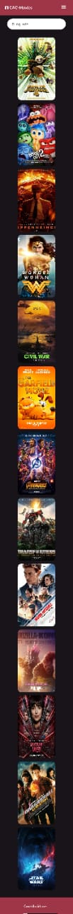

#### Register.php
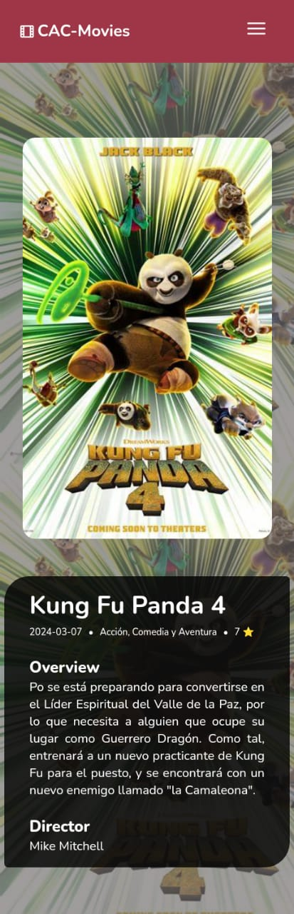

#### Register.php
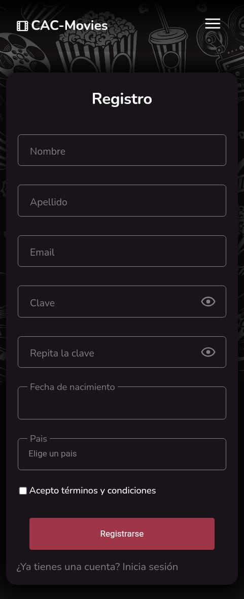

#### Login.php
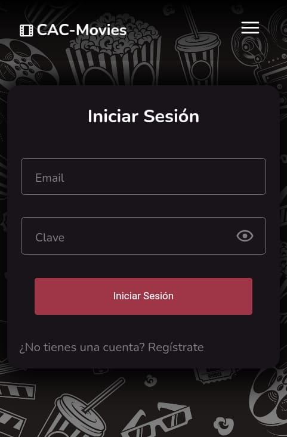

#### Dashboard.php
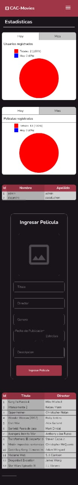

